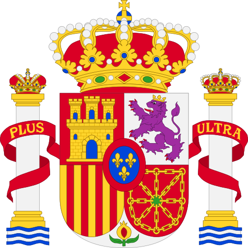
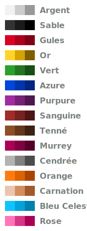

# Palettes

This repository include free-to-use color palettes, distributed as GPL files (compatible with GIMP, Inkscape, Pinta, etc.).

## Heraldica

A harmonic and mostly complete palette for painting coat of arms.

Here are some assorted coats of arms taken from Wikimedia Commons and recolored using the palette, for example:

|  |  |
| --- | --- |
| Spain ([source](https://commons.wikimedia.org/wiki/File:Escudo_de_Espa%C3%B1a_(nuevo_dise%C3%B1o).svg)) | Canada, 1907-1921 ([source](https://en.wikipedia.org/wiki/File:Arms_of_Canada_1907.svg)) |

The palette defines, for each [heraldic tincture](https://en.wikipedia.org/wiki/Tincture_(heraldry)), a triplet of colors.

- Color #1: Main color, for use in backgrounds, etc.
- Color #2: Accent color, for adding depth or minor embellishments
- Color #3: Contour color (you can use black if you prefer)

Apart from the seven conventional tinctures -- [*Argent*](https://en.wikipedia.org/wiki/Argent) (silver i.e. white), [*Or*](https://en.wikipedia.org/wiki/Or_(heraldry)) (gold i.e. yellow), [*Gules*](https://en.wikipedia.org/wiki/Gules) (red), [*Azure*](https://en.wikipedia.org/wiki/Azure_(heraldry)) (blue), [*Sable*](https://en.wikipedia.org/wiki/Sable_(heraldry)) (black), [*Vert*](https://en.wikipedia.org/wiki/Vert_(heraldry)) (green), and [*Purpure*](https://en.wikipedia.org/wiki/Purpure) (purple) --, the palette includes the following tinctures:

- [*Sanguine*](https://en.wikipedia.org/wiki/Sanguine_(heraldry)) (brownish blood-red), the heraldic [stain](https://en.wikipedia.org/wiki/Stain_(heraldry))
- [*Tenné*](https://en.wikipedia.org/wiki/Tenné) (tawny), the heraldic stain; depicted slightly darker than conventionally, being convoluted with [*Brunâtre*](https://en.wikipedia.org/wiki/Brunâtre) (dark brown), [*Ochre*](https://en.wikipedia.org/wiki/Ochre#In_heraldry_and_vexillology) and other usages [*au naturel*](https://en.wikipedia.org/wiki/Tincture_(heraldry)#Proper)
- [*Murrey*](https://en.wikipedia.org/wiki/Murrey) (maroon), the heraldic stain
- [*Cendrée*](https://en.wikipedia.org/wiki/Cendrée) (ash-gray); can also be used for iron and steel (e.g. in helmets)
- [*Orange*](https://en.wikipedia.org/wiki/Orange_(heraldry))
- [*Carnation*](https://en.wikipedia.org/wiki/Carnation_(heraldry)) (pale skin); can also be used for [*Buff*](https://en.wikipedia.org/wiki/Buff_(colour)#U.S._Army)
- [*Bleu Celeste*](https://en.wikipedia.org/wiki/Bleu_celeste) (sky blue); can also be used for [*Serafimerorden*](https://en.wikipedia.org/wiki/Order_of_the_Seraphim) ribbons
- [*Rose*](https://en.wikipedia.org/wiki/Rose_(heraldic_tincture)) (pink)

The palette also includes a pure white color; it's recommended to always use *Argent*, except for eye glows and, optionally, in [labels](https://en.wikipedia.org/wiki/Label_(heraldry)).

The palette does not include all possible tinctures and [proper](https://en.wikipedia.org/wiki/Tincture_(heraldry)#Proper) colors, to avoid confusions. This palette is based on Inkscape's [default palette](https://gitlab.com/inkscape/inkscape/-/blob/master/share/palettes/inkscape.gpl), that can be used as source for adding new colors; suggestions and discussions can be made on repo's [Issues](https://github.com/leopiccionia/palettes/issues) tab.

## Heraldica (Legacy)

A previous iteration of [Heraldica](#heraldica) palette for painting coat of arms, that I've used for years before settling on the improved version.

Its structure is identical to Heraldica, and both share some colors.

